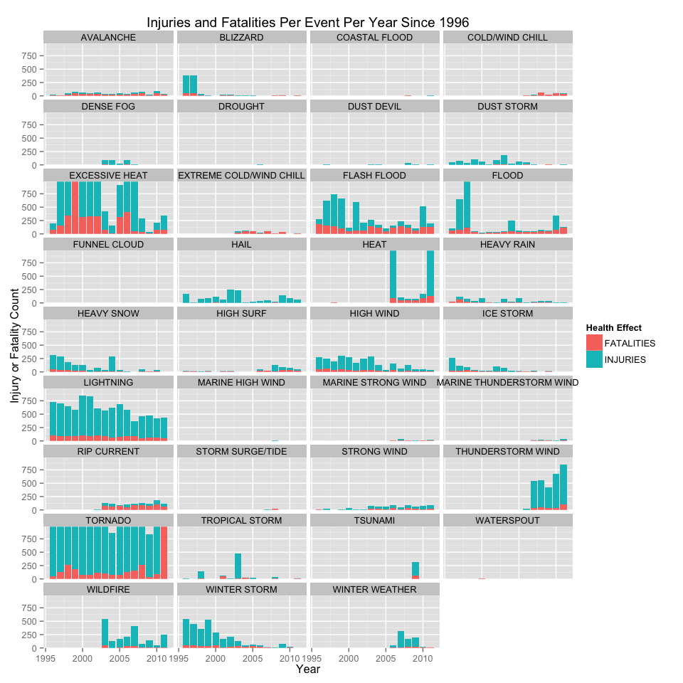
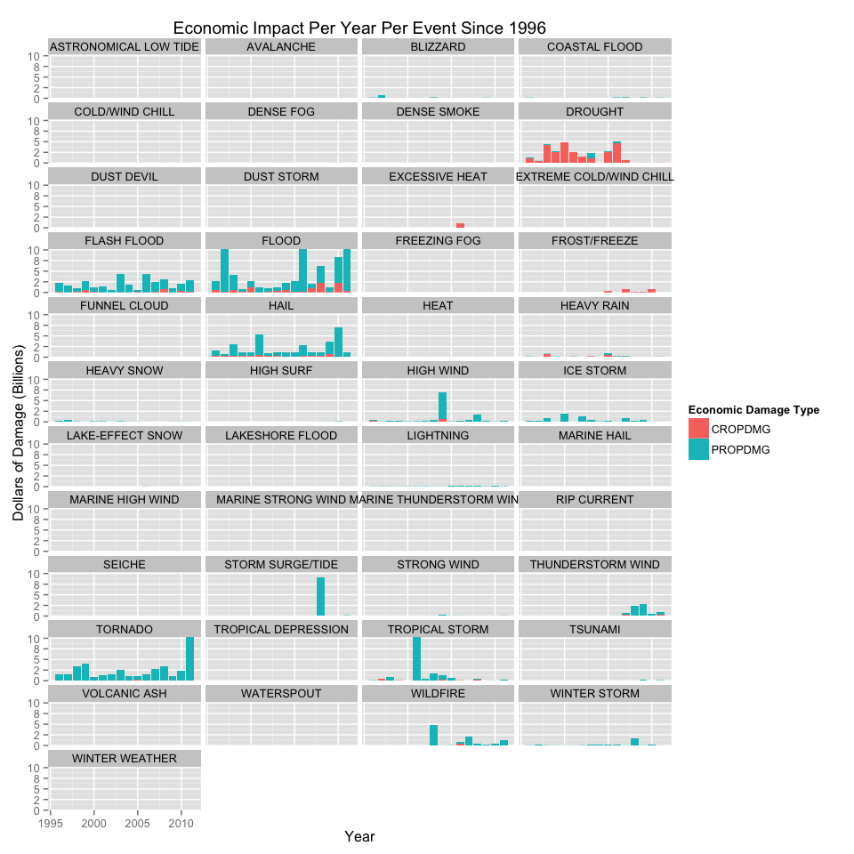

# Economic and Public Health Impact of Storm Events

Consider writing your report as if it were to be read by a government or municipal manager who might be responsible for preparing for severe weather events and will need to prioritize resources for different types of events.

Across the United States, which types of events (as indicated in the EVTYPE variable) are most harmful with respect to population health?

Across the United States, which types of events have the greatest economic consequences?

## Install and Load Libraries

```r
# Auto Install Packages
list.of.packages <- c("dplyr", "ggplot2", "knitr", "lubridate", "tidyr")
new.packages <- list.of.packages[!(list.of.packages %in% installed.packages()[,"Package"])]

if(length(new.packages)) install.packages(new.packages)

## Bring in the libs.
library(dplyr)
library(tidyr)
library(ggplot2)
library(knitr)
library(lubridate)

## Knitr setup for rounding:
options(scipen = 1, digits = 1)

print("SETUP")
```

```
## [1] "SETUP"
```


## Synopsis
Storms and other severe weather events can cause various problems for communities and municipalities.  These problems tend to include economic issues such as property and crop damage, as well as public health issues, such as fatalities or injuries.  Being prepared for these situations is important and knowing which events are likely to cause the most of a certain type of damage is extremely important for preparation.

Our analysis allows us to identify different storm events and their impact on the economic and health metrics of communities.  Knowing this information will help responders be better prepared for these events.

## Data Processing 

We first read in the storm data from the raw CSV file included in the zip archive. 


```r
## Results
data <- read.csv('data//repdata-data-StormData.csv.bz2')
```

Now let's look at some of the column headings:

```r
names(data)
```

```
##  [1] "STATE__"    "BGN_DATE"   "BGN_TIME"   "TIME_ZONE"  "COUNTY"    
##  [6] "COUNTYNAME" "STATE"      "EVTYPE"     "BGN_RANGE"  "BGN_AZI"   
## [11] "BGN_LOCATI" "END_DATE"   "END_TIME"   "COUNTY_END" "COUNTYENDN"
## [16] "END_RANGE"  "END_AZI"    "END_LOCATI" "LENGTH"     "WIDTH"     
## [21] "F"          "MAG"        "FATALITIES" "INJURIES"   "PROPDMG"   
## [26] "PROPDMGEXP" "CROPDMG"    "CROPDMGEXP" "WFO"        "STATEOFFIC"
## [31] "ZONENAMES"  "LATITUDE"   "LONGITUDE"  "LATITUDE_E" "LONGITUDE_"
## [36] "REMARKS"    "REFNUM"
```

In order to understand the health and economic impacts of the events, we'll need event information, location information and health and economic impact information.  Let's select only those columns from the dataset.  We will also change the data types of several columns.


```r
stormData <- select(
        data,
        REFNUM,
        BGN_DATE, # Date the event started
        STATE, # Abbreviation of the state
        EVTYPE, # Event type
        END_DATE, # END date
        FATALITIES, # Fatalities
        INJURIES, # Injuries
        PROPDMG, # Property Damage
        PROPDMGEXP, # Magnitude Number (K = thousands, M = Millions, etc)
        CROPDMG, # Crop Damage
        CROPDMGEXP # Magnitude Number (K = thousands, M = Millions, etc)
    ) %>%
    # Change the date columns into date objects.
    mutate(BGN_DATE = mdy_hms(BGN_DATE), END_DATE = mdy_hms(END_DATE)) %>%
    mutate(CROPDMGEXP = toupper(CROPDMGEXP), PROPDMGEXP = toupper(PROPDMGEXP))
```

Since we want to make our analysis over different event types, we should explore the distribution of the event types first.  


```r
unique_events <- nrow(as.data.frame(unique(stormData$EVTYPE)))
unique_events
```

```
## [1] 985
```

We can see that there are 985 unique events in the data, while there are only 48 event types in [NATIONAL WEATHER SERVICE - INSTRUCTION 10-1605](https://d396qusza40orc.cloudfront.net/repdata%2Fpeer2_doc%2Fpd01016005curr.pdf)  

In order to mitigate this, I've created a dataset containing the 48 Event Types.  Let's load that in now, and filter the storm data to include only the events containing one of the 48 official events.


```r
# Load in event types.
evTypes <- read.csv('data/events.csv')
# Make sure that all event types in stormData are upper case.
stormData <- mutate(stormData, EVTYPE = toupper(EVTYPE))
# Make sure that all event types in event types are upper case.
evTypes <- mutate(evTypes, EVTYPE = toupper(EVTYPE))
# Filter the stormData to include only events that match the 48.
stormData <- semi_join(stormData, evTypes, by="EVTYPE")
```

NOA data goes back to 1950, but according to the assignment, most recent years should be considered more complete.  In addition, the [Storm Data DB Info Page](http://www.ncdc.noaa.gov/stormevents/details.jsp?type=eventtype) makes it clear that the full 48 events have only been collected since 1996.  Previously only tornado, or tornado, thunderstorm and hail data were collected. This would significantly skew our results, so we want to make sure to subset our data to include events starting January 1996.  This shouldn't be too bad because we still get a solid 8 years of data to analyze.


```r
stormData <- stormData %>%
    filter(BGN_DATE > mdy("01/01/1996")) %>%
    mutate(BGN_DATE = year(BGN_DATE), END_DATE = year(END_DATE))
```

The PROPDMG and PROPDMGEXP as well as CROPDMG and CROPDMGEXP are not comparable numbers, since the number in the PROPDMG column is multiplied by the letter of the PROPDMGEXP Column (same for CROPDMG).  Let's fix that. 


```r
# Create function to change the letters to numerical multipliers.
set_multiplier <- Vectorize(function(x) {
    multiplier <- 0
    if (x == "K")
        multiplier <- 1000
    if (x == "M")
        multiplier <- 1000000
    if (x == "B")
        multiplier <- 1000000000
    
    multiplier
})

# Multiply the damage by its multiplier.
stormData <- stormData %>%
    mutate(PROPDMGEXP = set_multiplier(PROPDMGEXP)) %>%
    mutate(CROPDMGEXP = set_multiplier(CROPDMGEXP)) %>%
    mutate(PROPDMG = PROPDMG * PROPDMGEXP) %>%
    mutate(CROPDMG = CROPDMG * CROPDMGEXP) %>%
    # Let's put the damage into millions
    mutate(CROPDMG = CROPDMG / 1000000) %>%
    mutate(PROPDMG = PROPDMG / 1000000)
```

In addition, to make our data fit the tidy data definition, let's condense the economic variables and the health variable to fit into two separate columns:


```r
stormData <- gather(stormData, HE, HE_INST, FATALITIES, INJURIES) %>%
    gather(DMG, DMG_AMT, CROPDMG, PROPDMG)
```

Let's also do another select to get rid of the columns we no longer need:


```r
stormData <- select(stormData, -PROPDMGEXP, -CROPDMGEXP, -END_DATE)
st <- sample_n(stormData, 10000)
```

# Results
## Across the United States, which types of events are most harmful with respect to population health?

Since we classify direct injuries and fatalities as harmful to population health, let's examine these variables in relation to various events.  

In order to get a clean picture, we will summarize the data and will exclude events that resulted in 0 injuries and 0 fatalities.


Lastly, we will also set the y scale to one standard deviation above the mean for total of injuries + fatalities in order to be able to see the pattern more clearly.


```r
he_data <- stormData

he_data <- he_data %>%
    group_by(BGN_DATE, EVTYPE, HE) %>%
    summarise(H_IMP = sum(HE_INST)) %>%
    filter(H_IMP > 0)

yscale <- c(0, mean(he_data$H_IMP + sd(he_data$H_IMP)))

he <- ggplot(
    data = he_data,
    aes(x = BGN_DATE, y = H_IMP, fill=HE)
) + 
labs(
    title = "Injuries and Fatalities Per Event Per Year Since 1996",
    x = "Event Type",
    y = "Injury or Fatality Count"
) + 
geom_bar(stat = "identity", position="stack") + 
scale_fill_discrete(name = "Health Effect") + 
facet_wrap(~ EVTYPE, ncol = 4) +
coord_cartesian(ylim = yscale)

print(he)
```




## Across the United States, which types of events have the greatest economic consequences? 

If we look at economic consequences as crop damages and property damages, we can use the data to analyze how much monetary damage each event causes.

As we did above, we will remove any events that caused $0 in property damage and $0 in crop damage from the graph.

Lastly, we will also set the y scale to one standard deviation above the mean for total economic damage in order to be able to see the pattern more clearly.


```r
# Todo data change.
dmg_data <- stormData

dmg_data <- dmg_data %>%
    group_by(BGN_DATE, EVTYPE, DMG) %>%
    summarise(DMG_TOT = sum(DMG_AMT)) %>%
    filter(DMG_TOT > 0)

yscale <- c(0, mean(dmg_data$DMG_TOT + sd(dmg_data$DMG_TOT)))

dmg <- ggplot(
    data = dmg_data,
    aes(x = BGN_DATE, y = DMG_TOT, fill=DMG)
) + 
labs(
    title = "Economic Impact Per Year Per Event Since 1996",
    x = "Event Type",
    y = "Dollars of Damage (Millions)"
) + 
geom_bar(stat = "identity", position="stack") + 
scale_fill_discrete(name = "Economic Damage Type") + 
facet_wrap(~ EVTYPE, ncol = 4) +
coord_cartesian(ylim = yscale)

print(dmg)
```



## Exploring High Impact Events.
From the figures above, we can see visually that there are some events that cause a lot more economic impact than others, and other events that cause a lot more health impact than others.  It could be interesting to see the economic and health impacts of events that are more significant in their impact than the rest.  Let's take a look:


```r
# Filter health data to include totals only above the mean.
he_above_mean <- he_data %>%
    filter(H_IMP > mean(H_IMP))

# Filter economic impact data to include only totals above the mean.  Then Join the health impact data.

both_above_mean <- dmg_data %>%
    filter(DMG_TOT > mean(DMG_TOT)) %>%
    inner_join(he_above_mean)
```

```
## Joining by: c("BGN_DATE", "EVTYPE")
```

```r
ovr <- ggplot(
    data = both_above_mean,
    aes(x = BGN_DATE)
) + 
labs(
    title = "",
    x = "",
    y = "") + 
geom_bar(stat = "identity", position="stack", aes(y=DMG_TOT, fill=DMG)) + 
scale_fill_discrete(name = "Economic Damage Type") + 
facet_wrap(~ EVTYPE, ncol = 4) +
coord_cartesian(ylim = yscale)


print(ovr)
```


